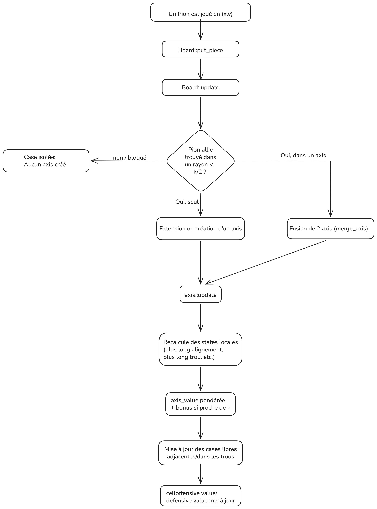

# Gammatoe — IA de morpion généralisé (Gomoku) à évaluation incrémentale

Projet réalisé dans le cadre d'une SAE (BUT Informatique). Le sujet consistait à développer une IA jouant au morpion sur une grille pouvant atteindre 15×15. J'ai choisi de généraliser le problème en concevant une IA pour un Gomoku généralisé (taille NxN avec k pions à aligner) capable de rester réactive sur des grilles beaucoup plus grandes, testées jusqu'à 200×200.

L'architecture de Gammatoe est née d'une observation faite en jouant plusieurs parties sur papier. Sur les grandes grilles, je ne raisonnais pas sur l'ensemble des cases, mais uniquement sur les alignements existants, les trous qui pouvaient les relier et les intersections entre plusieurs menaces. Plutôt que de demander à l'IA de réanalyser toute la grille après chaque coup, j'ai donc construit un modèle interne représentant directement ces éléments afin qu'elle manipule les mêmes informations que celles qui guidaient mon propre raisonnement.

## Sommaire

- [Gammatoe — IA de morpion généralisé (Gomoku) à évaluation incrémentale](#gammatoe--ia-de-morpion-généralisé-gomoku-à-évaluation-incrémentale)
  - [Sommaire](#sommaire)
  - [Aperçu](#aperçu)
  - [Compilation et exécution](#compilation-et-exécution)
  - [Architecture de Gammatoe](#architecture-de-gammatoe)
    - [Le problème que ça résout](#le-problème-que-ça-résout)
    - [Les briques de données (`types.h` / `types.cpp`)](#les-briques-de-données-typesh--typescpp)
    - [Encapsulation vis-à-vis de l'API imposée](#encapsulation-vis-à-vis-de-lapi-imposée)
  - [Fonction d'évaluation](#fonction-dévaluation)
  - [Comparaison avec l'IA de référence faite par mon camarade](#comparaison-avec-lia-de-référence-faite-par-mon-camarade)
  - [Résultats de performance](#résultats-de-performance)
  - [Limites connues et pistes d'amélioration](#limites-connues-et-pistes-damélioration)
  - [Structure du dépôt et attribution](#structure-du-dépôt-et-attribution)

## Aperçu

- Grille carrée de taille arbitraire et condition de victoire (`K` pions alignés) paramétrables au lancement, sans recompilation.
- Alignement détecté dans les 4 directions (horizontale, verticale, diagonale ↘ et diagonale ↙).
- Une IA (`Gammatoe`) qui choisit son coup en lisant des valeurs **déjà calculées** plutôt qu'en les recalculant à chaque tour.
- Un mode de comparaison (`main_bis.cpp`) qui fait jouer `Gammatoe` contre `IA_Morpion` et chronomètre chaque coup de `Gammatoe` (`std::chrono`) pour produire un temps moyen par coup.

## Compilation et exécution

Le projet n'a pas de dépendance externe, seul un compilateur C++17 est nécessaire (utilisation de `std::optional`, `std::weak_ptr`/`enable_shared_from_this`, etc.).

```bash
g++ -std=c++17 -O2 main_bis.cpp Gammatoe.cpp types.cpp -o morpion
./morpion
```

Le programme demande ensuite, dans l'ordre :

```
size = 30
nbPion = 5
Voulez-vous afficher le morpin ? (y pour oui)n
```

- `size` : taille `N` de la grille (`N×N`).
- `nbPion` : nombre de pions `K` à aligner pour gagner.
- la dernière question active ou non l'affichage texte de la grille après chaque coup (`y` pour l'activer, utile en petite taille, à désactiver pour les grandes grilles).

Le premier joueur (X ou O) est choisi aléatoirement. À la fin de la partie (alignement ou grille pleine), le programme affiche le temps moyen passé par `Gammatoe` pour choisir un coup.

## Architecture de Gammatoe

### Le problème que ça résout

Une implémentation naïve d'une IA de morpion généralisé évalue une case en parcourant, pour chacune des 4 directions, la grille jusqu'à trouver une rupture d'alignement. Refaire ce parcours pour chacune des `N²` cases libres, à chaque coup, coûte de l'ordre de **O(N³)** par coup (c'est exactement l'approche retenue par `IA_Morpion`, détaillée plus bas). Sur une petite grille de 15×15 ce coût reste négligeable ; sur une grille de 100×100 ou 200×200, ce recalcul intégral devient le facteur limitant.

L'idée derrière `Gammatoe` est de **ne jamais repartir de zéro** : le plateau est représenté par une structure persistante qui ne met à jour que le voisinage du coup joué, et chaque case libre conserve en cache la valeur stratégique qu'elle a déjà accumulée. Choisir un coup revient alors à lire `N²` valeurs déjà calculées plutôt qu'à les reconstruire.

### Les briques de données (`types.h` / `types.cpp`)



Quatre structures principales portent cette logique :

- **`piece`** : un pion posé, avec une référence faible (`weak_ptr`) vers l'`axis` qui le porte dans chacune des 4 directions.
- **`axis`** : un alignement de pions d'un même joueur dans une direction donnée. Il mémorise ses segments de pions consécutifs (`adj_pcs`), ses trous (`gaps`), son plus long alignement pur, son plus long alignement « potentiel » (un alignement qui ne demande plus qu'un seul pion pour combler un trou), et une valeur stratégique `axis_value`. Plusieurs `axis` peuvent être chaînés entre eux (`Link`, `root`/`last`) pour représenter de très longues lignes sans dupliquer l'information.
- **`cell`** : chaque case libre accumule les contributions de tous les `axis` qui la touchent (un pour chaque direction), séparément pour l'attaque (`offensive_value`) et la défense (`defensive_value`).
- **`Board`** : orchestre la création, la fusion et la mise à jour des `axis` à chaque coup, et expose le score combiné de chaque case via `cell::general_value()`.

Le point clé est `Board::update` : au lieu de scanner toute la grille, elle ne regarde que jusqu'à `⌈K/2⌉` cases dans chacune des 8 demi-directions autour du coup joué — au-delà de cette distance, un trou est de toute façon trop grand pour être comblé avant la fin de la partie, il est donc inutile de le suivre. Cette borne, dérivée directement de la condition de victoire `K` et non de la taille `N` du plateau, est ce qui permet à la mise à jour de rester locale même quand `N` augmente.

### Encapsulation vis-à-vis de l'API imposée

Le sujet imposait de travailler sur une grille `char**` (`morpion.h`/`morpion.cpp`, fournis par l'enseignant). `Gammatoe` ne lit jamais cette grille : elle maintient son propre modèle interne (`Board`) et n'expose que deux méthodes, `play_opponent(x, y)` (pour lui signaler le coup adverse) et `play()` (pour obtenir son propre coup). `main_bis.cpp` se charge de répercuter chaque coup dans les deux représentations en parallèle, une pour l'affichage imposé, une pour la logique de l'IA.

Ce découplage volontaire (le fichier `Gammatoe.h` le documente explicitement comme une « boîte noire ») rend l'IA indépendante du moteur de jeu fourni : elle pourrait être branchée sur n'importe quel système capable de lui annoncer des coordonnées de coups, sans dépendre du format `char**` ni des fonctions `morpion_*`.

## Fonction d'évaluation

Chaque `axis` calcule sa valeur ainsi (`axis::modify_stats`) :

```
score = 5.0  × plus_long_alignement_pur
      + 3.5  × plus_long_alignement_potentiel   (alignement + 1 trou comblable)
      - 1.0  × plus_grand_trou
      - 0.5  × nombre_de_trous

si plus_long_alignement_pur ≥ K - 2  →  score ×= 1500
sinon si plus_long_alignement_pur ≥ K - 3  →  score ×= 250
```

Cette amplification non linéaire crée un gradient de décision fort : une ligne encore loin de gagner contribue peu au score des cases voisines, mais dès qu'elle approche du seuil `K`, sa valeur explose, ce qui pousse naturellement l'IA à privilégier les coups décisifs sans avoir besoin d'un cas particulier codé en dur pour « coup gagnant immédiat ».

Cette valeur d'axe est ensuite propagée vers les cases libres concernées (extrémités de la ligne et trous comblables), où elle est cumulée séparément selon qu'elle vient d'un axe du joueur (`offensive_value`) ou de l'adversaire (`defensive_value`). Le score final d'une case libre (`cell::general_value`) combine les deux avec une priorité légèrement défensive :

```
valeur_case = 0.75 × offensive_value + 1.25 × defensive_value
```

`Gammatoe::play()` parcourt alors les `N²` cases libres et retient simplement celle dont `general_value()` est maximale — un seul passage de lecture, sans aucun recalcul d'alignement à cet instant.

## Comparaison avec l'IA de référence faite par mon camarade

`IA_Morpion.cpp`, fournie par mon camarade comme point de comparaison, répond au même problème avec une approche plus directe : pour chaque case libre, `scoreCalculation` appelle `countAligned` dans les 4 directions (8 sens) pour compter, à chaque fois, le nombre de pions alignés en repartant de zéro. Si cet alignement atteint ou dépasse `K`, un score fixe est ajouté (20000 pour une victoire immédiate côté X, 10000 pour bloquer une défaite), avec un palier intermédiaire (400 / 300) à `K-1`. Le score d'attaque et de défense est ensuite simplement additionné, sans pondération différenciée.

|                                   | `Gammatoe`                                                               | `IA_Morpion` (celle de mon camarade)                            |
| --------------------------------- | ------------------------------------------------------------------------ | --------------------------------------------------------------- |
| Modèle de plateau                 | Graphe persistant d'`axis` chaînés, mis à jour de façon incrémentale     | `char**` brut, aucun état conservé entre deux coups             |
| Évaluation d'une case             | Lecture d'une valeur déjà en cache (`general_value()`)                   | Recalcul complet par balayage des 4 directions (`countAligned`) |
| Coût par coup (ordre de grandeur) | ≈ O(N²) pour choisir le meilleur coup, mise à jour locale bornée par `K` | ≈ O(N³) (N² cases × balayage en O(N) par case)                  |
| Pondération attaque/défense       | 0,75 / 1,25 (défense favorisée)                                          | additive, légèrement favorable à l'attaque (20000 vs 10000)     |
| Profondeur de recherche           | 1 coup (glouton)                                                         | 1 coup (glouton)                                                |
| Dépendance à l'API du sujet       | Aucune (boîte noire, modèle interne propre)                              | Directe (lit/écrit le `char**` du sujet)                        |

Les deux IA restent **gloutonnes** : aucune des deux n'explore plusieurs coups à l'avance (pas de minimax, pas d'élagage alpha-bêta). La différence se situe entièrement dans la façon dont chacune obtient le score d'une case : reconstruction complète à chaque tour pour l'une, lecture d'un cache maintenu en continu pour l'autre.

## Résultats de performance

`main_bis.cpp` chronomètre chaque appel à `Gammatoe::play()` avec `std::chrono::steady_clock` et affiche la moyenne en nanosecondes à la fin de la partie. Sur une grille **200×200** (fichier `test grille 200 par 200.txt`, plusieurs exécutions) :


soit environ **0,84 ms en moyenne par coup**, alignements compris, sur une grille largement au-delà des 15×15 demandés par le sujet. Sur une grille 30×30, le même programme mesure une moyenne de l'ordre de 5 µs par coup, ce qui est cohérent avec une croissance du temps de sélection proche de `N²` (le coût de la mise à jour locale des `axis`, lui, reste borné par `K` et n'explique qu'une faible part de cette croissance).

## Limites connues et pistes d'amélioration

Honnêtement, quelques points seraient à retravailler pour aller plus loin :

- **Recherche à un seul coup.** Comme `IA_Morpion`, `Gammatoe` ne fait aucune anticipation : elle joue le meilleur coup immédiat sans simuler les réponses de l'adversaire. La structure incrémentale serait pourtant un bon point de départ pour un minimax peu profond, puisque jouer/annuler un coup et relire le score d'une case restent des opérations bon marché.
- **`Board::split_axis` n'est jamais appelée.** Le code prévoit explicitement le cas où un trou suivi par un `axis` se retrouve coupé en deux (la fonction est entièrement implémentée, et `axis::modify_gaps` signale même en commentaire une « zone à risque »), mais aucun appel n'est déclenché dans `Board::update`. En pratique, `Board::update` ne traite que les coups du joueur propriétaire de l'axe ; un pion adverse posé dans un trou suivi rend simplement la case occupée (donc exclue du choix de coup), mais les statistiques de l'axe concerné (plus long alignement potentiel, etc.) ne sont pas recalculées pour refléter ce blocage. C'est une infrastructure anticipée mais pas encore branchée.
- **Cache par direction non cumulatif.** `cell::axis_values` ne conserve qu'une valeur par direction (la dernière reçue) plutôt que la somme de tous les axes qui pourraient théoriquement toucher la case dans cette direction. Le cas reste rare en pratique (deux axes distincts et non fusionnés dans la même direction touchant la même case libre), mais une agrégation plus rigoureuse serait plus exacte.
- **Sélection du meilleur coup en O(N²).** Même avec des valeurs en cache, retenir la meilleure case nécessite encore de parcourir toute la grille à chaque tour. Une file de priorité indexée sur les cases dont la valeur vient de changer permettrait de ne réexaminer que les candidats affectés par le dernier coup.
- **Pondérations « magiques ».** Les coefficients de `axis::modify_stats` et `cell::general_value` ont été choisis empiriquement et non appris ou optimisés par recherche de paramètres ; ils donnent de bons résultats à l'usage mais n'ont pas été formellement validés sur un grand nombre de parties.

## Structure du dépôt et attribution

| Fichier                          | Origine                              | Rôle                                                                                                     |
| -------------------------------- | ------------------------------------ | -------------------------------------------------------------------------------------------------------- |
| `morpion.h`, `morpion.cpp`       | Fournis par l'enseignant             | API imposée par le sujet (grille `char**`, affichage, victoire, etc.)                                    |
| `IA_Morpion.h`, `IA_Morpion.cpp` | Écrits par mon camarade de promotion | IA de référence pour la comparaison, approche par recalcul complet                                       |
| `types.h`, `types.cpp`           | Mon travail                          | Structures de données internes (`Board`, `cell`, `axis`, `piece`) et logique de mise à jour incrémentale |
| `Gammatoe.h`, `Gammatoe.cpp`     | Mon travail                          | Interface « boîte noire » de l'IA (`play`, `play_opponent`) construite au-dessus de `types.*`            |
| `main_bis.cpp`                   | Mon travail                          | Boucle de jeu, synchronisation des deux représentations du plateau, chronométrage                        |
| `test grille 200 par 200.txt`    | Mon travail                          | Relevé de performance sur une grille 200×200                                                             |