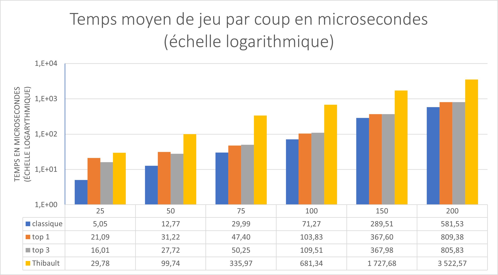

# Gammatoe — IA de Morpion Généralisé

> SAE 1.02 — Comparaison d'approches algorithmiques  
> Implémentation d'une IA jouant au morpion généralisé sur des grilles jusqu'à 20×20 avec k pions à aligner configurable

---

## Présentation du projet

Ce projet s'inscrit dans le cadre d'une SAE (Situation d'Apprentissage et d'Évaluation) dont l'objectif initial était de concevoir une IA capable de jouer au morpion sur une grille allant jusqu'à 15×15. J'ai choisi d'aller plus loin en traitant le problème comme un **morpion généralisé** : taille de grille et nombre de pions à aligner sont entièrement paramétrables (le `main` est configuré par défaut sur une grille 20×20 avec 5 pions à aligner).

Le projet compare les performances de mon IA (`Gammatoe`) avec l'implémentation de mon camarade (Thibault), sur des parties jouées en autonomie.

---

## Architecture du projet

```
├── types.h / types.cpp       # Structures de données du plateau (mon implémentation)
├── Gammatoe_core.cpp         # Moteur de décision de l'IA (mon implémentation)
├── morpion.h / morpion.cpp   # Interface de jeu fournie par l'enseignant
└── main.cpp                  # Point d'entrée — boucle de jeu
```

Les fichiers `IA_Morpion.h` et `IA_Morpion.cpp` (non inclus ici) constituent l'IA de Thibault, utilisée comme référence comparative.

---

## Choix techniques

### 1. Représentation du plateau par axes dynamiques et référencement croisé

C'est le cœur du projet, et de loin la partie la plus complexe à concevoir.

Plutôt que de recalculer les alignements depuis zéro à chaque coup — ce qui reviendrait à parcourir le plateau entier — j'ai mis en place un système d'**axes** (`struct axis`) : des objets qui représentent en temps réel une séquence de pions (ou de pions potentiels) dans l'une des quatre directions (H, V, D1, D2). Chaque axe maintient de façon incrémentale :

- ses **segments** (`adj_pcs`) : les runs de pièces consécutives qui le composent
- ses **gaps** : les cases vides tolérées au sein du potentiel alignement
- la **plus longue séquence courante** et la **plus longue séquence potentielle** (avec un gap de 1) pour l'évaluation rapide

La vraie difficulté ne réside pas dans la structure d'un axe pris isolément, mais dans le **référencement croisé** qui permet de maintenir ce système cohérent à toute modification du plateau.

**Le graphe de dépendances est à double sens et multi-niveaux :**

- Chaque `cell` du plateau possède un `shared_ptr<piece>`.
- Chaque `piece` contient un `std::array<weak_ptr<axis>, 4>` : une référence faible vers l'axe auquel elle appartient dans chacune des 4 directions. C'est le point d'entrée permettant, depuis n'importe quelle case occupée, de remonter instantanément à l'axe correspondant. Cet accès en O(1) n'est possible que parce que l'enum `direction` est **intentionnellement codé** avec des valeurs consécutives à partir de 0 (`H=0, V=1, D1=2, D2=3`), ce qui permet d'utiliser `static_cast<int>(d)` directement comme index dans le tableau. Ce n'est pas un détail : si les valeurs de l'enum venaient à changer, toute la mécanique de référencement s'effondrerait silencieusement.
- Chaque `axis` est lui-même détenu par le `Board` via une `std::list<shared_ptr<axis>>`, et stocke un itérateur direct `self_axes` vers sa propre position dans cette liste pour pouvoir s'effacer en O(1).
- Les axes qui se trouvent dans le prolongement l'un de l'autre (avec un gap entre eux) sont chaînés via une structure `Link` contenant deux `weak_ptr<axis>` (`axis1` et `axis2`). Cela forme une **liste doublement chaînée d'axes logiquement liés**.
- Chaque axe dans cette chaîne maintient des pointeurs `root` et `last` vers les deux extrémités logiques, ce qui permet à n'importe quel nœud de la chaîne de traverser l'ensemble (`traverse_piece_axis`, `traverse_gaps_axis`) et de synchroniser les statistiques globales.
- `axis` hérite de `std::enable_shared_from_this<axis>` : il peut produire lui-même un `weak_ptr` vers sa propre instance (`self()`), ce qui est indispensable pour s'inscrire dans les références croisées sans créer de cycles de possession ni invalider les pointeurs en cas de déplacement.

**Toute modification du plateau peut déclencher trois types d'opérations sur les axes :**

- **`create_axis`** — un nouveau pion est posé à proximité d'un autre pion allié ; un axe est créé entre les deux, et les deux pièces enregistrent cette référence dans leur `axiss`.
- **`merge_axis`** — le nouveau pion se trouve entre deux axes alignés existants, les réunissant en un axe logique continu. Les liens `axis1`/`axis2` et les ancres `root`/`last` sont redistribués dans toute la chaîne.
- **`split_axis`** — un pion adverse vient couper un axe en deux. L'opération identifie le gap concerné, déplace les segments et gaps correspondants dans un nouvel axe, reconfigure les liens, et re-synchronise les deux moitiés indépendamment.

Après chaque création, fusion ou scission, une synchronisation en cascade (`sync_axis`) propage les extremités, les ancres et les statistiques à l'ensemble des axes logiquement liés.

Ce référencement croisé est délicat à maintenir : la moindre incohérence entre les `weak_ptr` des pièces, les liens de la chaîne, et les ancres `root`/`last` produit soit des accès invalides, soit des statistiques corrompues qui faussent l'évaluation de l'IA. C'est précisément ce soin qui permet d'éviter tout recalcul global.

Ce codage strict des directions a une autre conséquence directe : toutes les fonctions de navigation (`prev`, `next`, `jump`) sont implémentées comme des `switch` exhaustifs sur les quatre cas de l'enum. Puisque l'enum ne peut prendre que ces quatre valeurs, la branche `default` est par construction inatteignable. Placer `std::unreachable()` dans ce `default` ne sert pas uniquement à l'exactitude sémantique — c'est un **contrat explicite au compilateur** lui permettant de supposer que cette branche n'existe pas, et d'optimiser en conséquence l'ensemble du dispatch. C'est une fonctionnalité de C++23, d'où l'obligation de compiler avec `-std=c++23`.

### 2. Scan de voisinage adaptatif à rayon borné

Lors de la mise à jour après un coup (`Board::update`), le code ne parcourt pas l'ensemble du plateau pour trouver les pièces voisines. Il explore dans les **8 demi-directions** depuis la case jouée, en s'arrêtant dès qu'une pièce est trouvée ou qu'une pièce adverse bloque la direction.

Le rayon maximal de ce scan est borné par `max_gap_size`, lui-même dérivé de `k` (nombre de pions à aligner) :

```cpp
if (number_piece_to_align_to_win % 2 == 0)
    max_gap_size = number_piece_to_align_to_win / 2;
else
    max_gap_size = number_piece_to_align_to_win / 2 + 1;
```

Cette borne n'est pas arbitraire : elle correspond exactement à la distance maximale au-delà de laquelle un gap ne peut plus faire partie d'un alignement gagnant. Au-delà, explorer davantage serait inutile.

Un flag `all_find` permet une sortie anticipée : dès que toutes les directions ont trouvé leur voisin (ou ont été bloquées), la boucle s'arrête sans compléter les itérations restantes.

### 3. Évaluation heuristique multi-critères et simulation légère

Chaque `cell` porte plusieurs valeurs flottantes indépendantes : `ai_offensive_value`, `ai_defensive_value`, ainsi que leurs équivalents du point de vue de l'adversaire (`opponent_*`). Ces scores sont calculés lors de la mise à jour des axes, pas à la demande, ce qui les rend disponibles immédiatement lors de la phase d'évaluation.

Pour choisir son coup, l'IA simule chaque case vide en effectuant une copie complète du plateau (`Board tmp = board`), y place le pion, déclenche la mise à jour des axes, puis lit `ai_general_value()` sur la case jouée. La copie de plateau est rendue abordable par le fait que le `Board` est un `std::vector<cell>` — la copie du vecteur suffit à isoler la simulation sans toucher au plateau réel.

### 4. Cache de meilleurs coups : pourquoi c'est plus lent

Trois variantes ont été benchmarkées :

- **classique** — évaluation complète, sans aucun état persistant entre les tours
- **top1** — mise en cache du meilleur coup du tour précédent
- **top3** — cache des 3 meilleurs coups du tour précédent

L'hypothèse était que mémoriser les meilleurs candidats du tour précédent permettrait d'orienter plus vite la recherche. En pratique, **le cache est systématiquement plus lent**, et ce sur toutes les tailles de grille. Deux raisons expliquent ce résultat :

Premièrement, le cache introduit un **surcoût de gestion** : mémoriser, trier et accéder aux meilleurs coups précédents coûte du temps, même pour top1. Or la variante classique est déjà très rapide car l'évaluation d'une case — une copie de plateau suivie d'une mise à jour incrémentale — est peu coûteuse individuellement.

Deuxièmement, et c'est la raison plus fondamentale, **les meilleurs coups changent radicalement d'un tour à l'autre**. Après chaque coup joué (le sien et celui de l'adversaire), la structure des axes est modifiée, les valeurs des cases recalculées, et les priorités stratégiques redistribuées. Un coup qui était optimal au tour T n'a aucune raison de l'être au tour T+2. Le cache ne fait donc que polluer la recherche avec des candidats potentiellement devenus médiocres, sans apporter de gain réel de convergence.

Ce résultat contreintuitif est lui-même instructif : l'efficacité d'un cache dépend entièrement de la **stabilité temporelle des valeurs mises en cache**. Ici, la dynamique du jeu rend cette stabilité trop faible pour que le cache soit rentable.

---

## Performances

Les mesures ci-dessous représentent le **temps moyen de décision par coup en microsecondes**, mesurés sur des parties complètes pour différentes tailles de grille.




**Observations :**

- La variante **classique** est la plus rapide sur toutes les tailles de grille — le surcoût du cache n'est jamais compensé (voir section ci-dessus).
- La croissance de Gammatoe reste **quasi-linéaire** avec la surface du plateau, ce qui confirme que la mise à jour incrémentale des axes limite bien la complexité effective à chaque coup.
- L'IA de Thibault présente une croissance **nettement plus rapide** : environ 6× plus lente à taille 200 (3 522 µs contre 581 µs). Cela indique une complexité asymptotique supérieure, probablement due à une approche plus proche du recalcul global.
- À taille 200 (grille 200×200, soit 40 000 cases), Gammatoe reste sous **600 µs par coup**, ce qui le rend jouable en temps réel même sur des grilles très largement au-delà du cahier des charges initial.

---

## Compilation

Le projet nécessite **C++23** (utilisation de `std::unreachable()`).

```bash
g++ -std=c++23 -O2 -o gammatoe main.cpp morpion.cpp types.cpp
```

---

## Utilisation

Au lancement, le programme démarre une partie sur une grille 20×20 (configurable dans `main.cpp`). L'IA joue les pions `X`, le joueur humain joue les `O` en entrant des coordonnées `x y` dans le terminal.

```
   0   1   2   3  ...
0 |   |   |   |   | ...
1 |   | X |   |   | ...
...
```

---

## Axes d'amélioration envisagés

- Intégration d'un **algorithme Minimax avec élagage alpha-bêta** pour une anticipation multi-coups
- Exploration d'une **évaluation par réseau de neurones** (MLP) — des champs `MLP_beam_search_bonus` et `MLP_final_decision_bonus` sont déjà présents dans la structure `cell` en prévision de cette extension
- Optimisation de la copie de plateau pour réduire les allocations mémoire lors de la phase de simulation